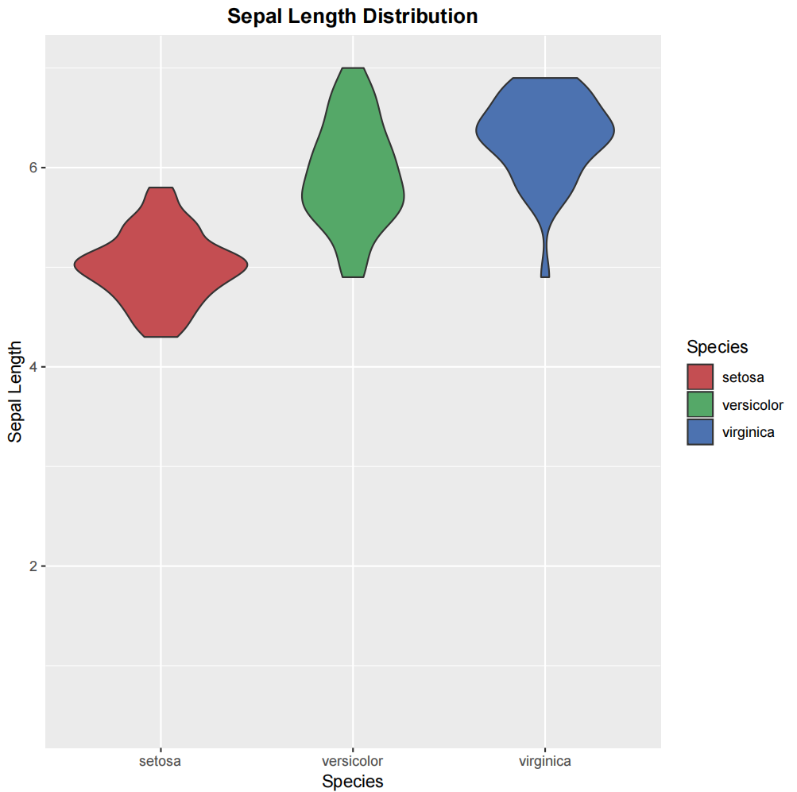

# PART I. BASIC SKILLS
## 3.2. Plot with R
## 课堂作业

基于ggplot2,用violin plot对iris数据集中不同Species的Sepal.Length长度分布进行可视化，并进行如下设置。画violin plot时可参考 2a)，对作图进行配置还可以参考本节的 1d) 和7)。 提交脚本和结果。

- 把图片标题设为"Sepal Length Distribution"，加粗居中(可使用labs函数和theme函数)

- 把y轴范围设为0.5到7之间(可使用scale_y_continuous函数)

- 三个Species的对应的填充颜色分别设为#C44E52, #55A868和#4C72B0(可使用scale_fill_manual函数)

---
### Rscript
```R
library(ggplot2)

ggplot(iris, aes(x = Species, y = Sepal.Length, fill = Species)) +
geom_violin() +
labs(
     title = "Sepal Length Distribution", 
     x = "Species", 
     y = "Sepal Length"
) +
theme(plot.title = element_text(face = "bold", hjust = 0.5))+
scale_y_continuous(limits = c(0.5, 7)) +
scale_fill_manual(values = c("#C44E52", "#55A868", "#4C72B0")) +
ggsave("sepal_length_distribution.pdf")
```
### Result
