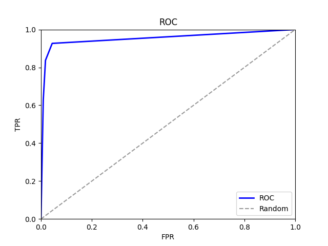

# PART IV.1 Machine Learning Basics 
## 1.5 Performance Evaluation

用你熟悉的脚本语言对BreastCancer数据集的预测结果 BreastCancer_predict.txt 进行评估，画出ROC curve，提交代码和ROC curve的图片。BreastCancer_predict.txt 中第一列为真实的数据标签，包括良性(benign,0)和恶性(malignant,1)，第二列为预测为正类(malignant,1)的概率值，用制表符"\t"分隔。

```python

import pandas as pd
import matplotlib.pyplot as plt
from sklearn.metrics import roc_curve, auc

data = pd.read_csv('./BreastCancer_predict.txt', sep='\t')
data.head()

def label_y(val):
    if val=='malignant':
        return 1
    return 0

y_test = data['y_true'].map(label_y)
y_pred = data['prediction_probability']

fpr, tpr, thresholds = roc_curve(y_test, y_pred, pos_label=1)
roc_auc = auc(fpr, tpr)

plt.plot(fpr, tpr, '-', color='b', label='ROC', lw=2)
plt.plot([0, 1], [0, 1], '--', color=(0.6, 0.6, 0.6), label='Random')
plt.xlim([0, 1])
plt.ylim([0, 1])
plt.title('ROC')
plt.xlabel('FPR')
plt.ylabel('TPR')
plt.legend()
plt.savefig('Breast_Cancer_ROC.png')
plt.close()
```

