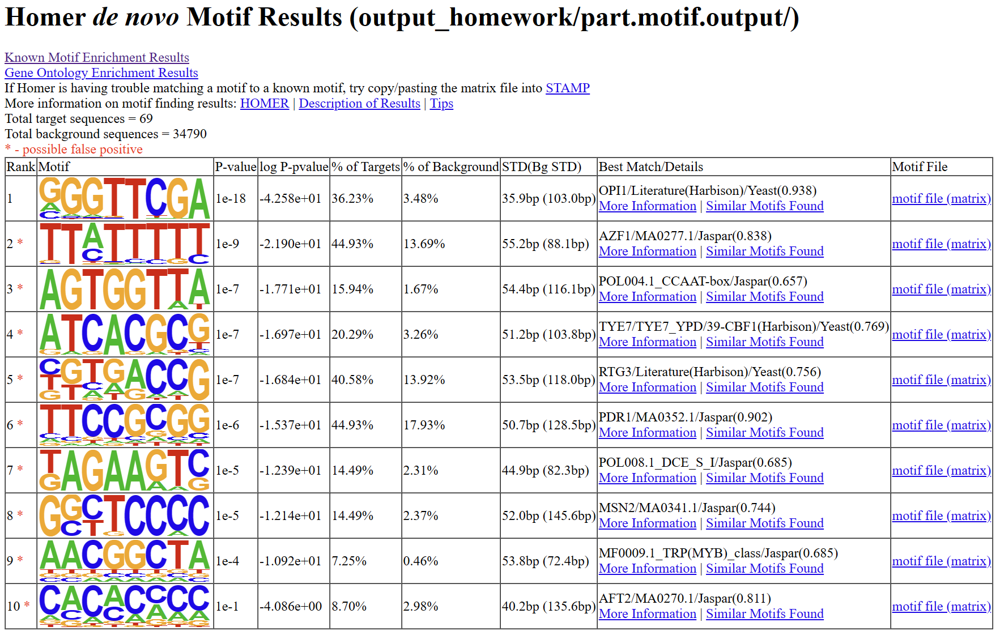

# Part II. NGS Data Analysis
## 3. ChIP-seq
## 课后作业


1. 请解释在ChIP-seq实验中为什么一般都要平行做一个 control （通常叫 input）的实验。

2. 请解释 findPeaks 和 findMotifsGenome.pl 主要参数的含义。

3. 我们在容器的/home/test/chip-seq/homework目录中提供了酵母Snf1蛋白CHIP-seq的bam文件，ip.chrom_part.bam为IP实验数据，input.chrom\_part.bam为背景数据。请大家从这两个文件出发，用homer重复本章中介绍的peak calling和motif finding分析。请大家提交找到的motif的截图，以及Fold Change (vs Control) >=8且p-value (vs Control) < 10^(−8)的peaks(建议放在同一个文件中提交)。

---

1. 

    1. 校正背景噪音和非特异性结合: ChIP-seq 实验中,抗体不仅会捕获目标蛋白结合的DNA片段，也会非特异性地结合一些无关的DNA序列。control样本可以反映这些非特异性背景信号，在后续数据分析时可用于校正这些噪音，提高分析的准确性。
    2. 确定基线信号水平: control样本反映了未经免疫沉淀处理的染色质背景信号水平。这个基线信号水平可用于评估免疫沉淀样本中的信号峰是否显著高于背景。
    3. 鉴定富集区域: 通过将免疫沉淀样本的信号与control样本进行比较，可以明确地鉴定出目标蛋白结合的富集区域，从而更准确地确定结合靶点。


2. 
### findPeaks

有7种基本操作模式:

- factor
用于单一接触或聚焦ChIP-Seq实验或DNase-Seq的峰值查找。这种分析对于转录因子很有用，旨在确定DNA-蛋白接触的精确位置。这种峰值查找使用固定宽度的峰值大小，该大小是根据标签自相关自动估计的

- histone
用于ChIP-Seq实验中发现的广泛富集区域(如组蛋白修饰)的峰值查找。这种分析可以找到可变宽度的峰值

- super
在数据中查找超级增强子

- groseq
从链特异性GRO-Seq中对新转录本进行de novo鉴定。这试图从nascent RNA测序读数中鉴定转录本

- tss
从5'RNA-Seq/CAGE或5'GRO-Seq数据中确定启动子/转录起始位点(TSS)

- dnase
对DNase-Seq峰值查找进行调整参数

- mC
DNA甲基化分析

使用如下：
```bash
findPeaks <tag directory> -style <factor | histone> -o auto -i <control tag directory>

# 使用例子
findPeaks ERalpha-ChIP-Seq/ -style factor -o auto -i Control-ChIP-Seq/
```
参数解释：
```bash
-style: 有factor, histone两种选择。转录因子和组蛋白修饰的CHIP-seq peak有不同的特性，所以在peak calling中也会使用不同的策略

-o : 输出文件路径

-i : 存储input样本中间文件的"tag directory"
```
官网资料：http://homer.ucsd.edu/homer/ngs/peaks.html

### findMotifsGenome.pl


```bash
findMotifsGenome.pl <pos file> <genome> <output directory> [additional options]

# 使用例子
findMotifsGenome.pl peaks.txt mm8r peakAnalysis -size 200 -len 8
```
基本参数解释（有很多的其它参数，参考官网）：
```
-bg <background position file> (用作背景的基因组位置，默认=自动)移除与目标位置重叠的背景位置
-chopify (将大的背景区域切分成目标区域的平均大小)
-len <#>[,<#>,<#>...] (motif长度,默认=8,10,12) [注意: 值大于12可能会导致程序耗尽内存 - 在这种情况下，请减少分析的序列数(-N)，或尝试分析更短的序列区域(即-size 100)]
-size <#> (用于motif发现的片段大小，默认=200)
-size <#,#> (即-size -100，50将获取从中心-100到+50的序列)
-size given (使用您提供的精确区域)
-S <#> (要优化的motif数量，默认: 25)
-mis <#> (全局优化: 搜索#个错配的字符串，默认: 2)
-norevopp (不在反向链上搜索motif)
-nomotif (不搜索de novo motif富集)
-rna (输出RNA motif图形并与RNA motif数据库进行比较，自动设置-norevopp)
```
官网资料：http://homer.ucsd.edu/homer/ngs/peakMotifs.html

3.
```bash
root@bioinfo_docker:/home/test/chip-seq# makeTagDirectory homework/ip    homework/ip.chrom_part.bam
        Will parse file: homework/ip.chrom_part.bam

        Creating directory: homework/ip and removing existing *.tags.tsv

        Treating homework/ip.chrom_part.bam as a bam file
        Reading alignment file homework/ip.chrom_part.bam

        Optimizing tag files...
        Estimated genome size = 2097191
        Estimated average read density = 0.668710 per bp
        Total Tags = 1402413.0
        Total Positions = 1001314
        Average tag length = 51.0
        Median tags per position = 1 (ideal: 2)
        Average tags per position = 1.401
        Fragment Length Estimate: 233
        Peak Width Estimate: 248
        Autocorrelation quality control metrics:
                Same strand fold enrichment: 1.1
                Diff strand fold enrichment: 1.1
                Same / Diff fold enrichment: 1.0

                Guessing sample is ChIP-Seq - may have low enrichment with lots of background
```
```bash
root@bioinfo_docker:/home/test/chip-seq# makeTagDirectory homework/input homework/input.chrom_part.bam
        Will parse file: homework/input.chrom_part.bam

        Creating directory: homework/input and removing existing *.tags.tsv

        Treating homework/input.chrom_part.bam as a bam file
        Reading alignment file homework/input.chrom_part.bam

        Optimizing tag files...
        Estimated genome size = 2095854
        Estimated average read density = 0.943163 per bp
        Total Tags = 1976732.0
        Total Positions = 1525353
        Average tag length = 51.0
        Median tags per position = 1 (ideal: 2)
        Average tags per position = 1.296
        Fragment Length Estimate: 56
        Peak Width Estimate: 11
                !!! No reliable estimate for peak size
                Setting Peak width estimate to be equal to fragment length estimate
        Autocorrelation quality control metrics:
                Same strand fold enrichment: 1.0
                Diff strand fold enrichment: 1.0
                Same / Diff fold enrichment: 1.0

                Guessing sample is ChIP-Seq - may have low enrichment with lots of background

```
```bash
root@bioinfo_docker:/home/test/chip-seq# findPeaks homework/ip/ -style factor -o output_homework/part.peak -i homework/input/
        Fragment Length = 233
        !!! Estimated genome size (from tag directory) is smaller than default
            genome size.  Using estimate (2097191) [to change specify -gsize]
        Total Tags = 1402413.0
        Tags per bp = 0.668710
        Max tags per bp set automatically to 66.0
        Finding peaks of size 248, no closer than 496
                Finding peaks on chrIV (minCount=164.8), total tags positions = 706357
                Finding peaks on chrV (minCount=164.8), total tags positions = 294957
                Tags Used for cluster (less clonal tags) = 1402326.0 / 1402413.0
        Expected tags per peak = 165.829834 (tbp = 0.668669)
                Threshold       Peak Count      Expected Peak Count     FDR     Poisson
                247     311.000 0.000   1.33e-07        2.45e-09
                246     312.000 0.000   2.00e-07        3.68e-09
                245     318.000 0.000   2.93e-07        5.51e-09
                244     320.000 0.000   4.33e-07        8.20e-09
                243     325.000 0.000   6.33e-07        1.22e-08
                242     328.000 0.000   9.27e-07        1.80e-08
                241     333.000 0.000   1.34e-06        2.65e-08
                240     334.000 0.001   1.96e-06        3.88e-08
                239     335.000 0.001   2.86e-06        5.66e-08
                238     338.000 0.001   4.12e-06        8.23e-08
                237     342.000 0.002   5.89e-06        1.19e-07
                236     345.000 0.003   8.43e-06        1.72e-07
                235     347.000 0.004   1.20e-05        2.47e-07
                234     352.000 0.006   1.70e-05        3.53e-07
                233     354.000 0.009   2.40e-05        5.03e-07
                232     355.000 0.012   3.40e-05        7.14e-07
                231     359.000 0.017   4.75e-05        1.01e-06
                230     362.000 0.024   6.63e-05        1.42e-06
                229     366.000 0.034   9.19e-05        1.99e-06
                228     369.000 0.047   1.27e-04        2.78e-06
                227     372.000 0.065   1.75e-04        3.86e-06
                226     379.000 0.090   2.38e-04        5.34e-06
                225     379.000 0.124   3.28e-04        7.36e-06
                224     387.000 0.171   4.41e-04        1.01e-05
                223     395.000 0.233   5.91e-04        1.38e-05
                222     402.000 0.317   7.90e-04        1.88e-05
                221     406.000 0.430   1.06e-03        2.54e-05
                220     408.000 0.580   1.42e-03        3.43e-05
                219     413.000 0.779   1.89e-03        4.61e-05
                218     420.000 1.042   2.48e-03        6.16e-05
                217     427.000 1.388   3.25e-03        8.21e-05
                216     436.000 1.840   4.22e-03        1.09e-04
                215     441.000 2.429   5.51e-03        1.44e-04
                214     445.000 3.193   7.18e-03        1.89e-04
                213     450.000 4.179   9.29e-03        2.47e-04
                212     456.000 5.445   1.19e-02        3.22e-04
                211     462.000 7.064   1.53e-02        4.18e-04
                210     470.000 9.124   1.94e-02        5.39e-04
                # ... skipped
        0.10% FDR Threshold set at 222.0 (poisson pvalue ~ 1.88e-05)
        402 peaks passed threshold
        Differential Peaks: 79 of 402 (19.65% passed)
        Local Background Filtering: 69 of 79 (87.34% passed)
        Clonal filtering: 69 of 69 (100.00% passed)
        Total Peaks identified = 69
        Centering peaks of size 248 using a fragment length of 233
```

```bash
root@bioinfo_docker:/home/test/chip-seq# findMotifsGenome.pl output_homework/part.peak sacCer2 output_homework/part.motif.output -len 8

        Position file = output_homework/part.peak
        Genome = sacCer2
        Output Directory = homework_output/part.motif.output
        Motif length set at 8,
        Found mset for "yeast", will check against yeast motifs
        Peak/BED file conversion summary:
                BED/Header formatted lines: 0
                peakfile formatted lines: 69

        Peak File Statistics:
                Total Peaks: 69
                Redundant Peak IDs: 0
                Peaks lacking information: 0 (need at least 5 columns per peak)
                Peaks with misformatted coordinates: 0 (should be integer)
                Peaks with misformatted strand: 0 (should be either +/- or 0/1)

        Peak file looks good!

        Background files for 200 bp fragments found.

        Extracting sequences from directory: /home/test/homer/.//data/genomes/sacCer2//
        Extracting 47 sequences from chrIV
        Extracting 22 sequences from chrV

        Not removing redundant sequences


        Sequences processed:
                Auto detected maximum sequence length of 201 bp
                69 total

        Frequency Bins: 0.2 0.25 0.3 0.35 0.4 0.45 0.5 0.6 0.7 0.8
        Freq    Bin     Count
        0.35    3       5
        0.4     4       12
        0.45    5       20
        0.5     6       16
        0.6     7       16

        Total sequences set to 50000

        Choosing background that matches in CpG/GC content...
        Bin     # Targets       # Background    Background Weight
        3       5       5541    0.653
        4       12      23190   0.374
        5       20      15393   0.940
        6       16      4709    2.459
        7       16      1098    10.545
        Assembling sequence file...
        Normalizing lower order oligos using homer2

        Reading input files...
        50000 total sequences read
        Autonormalization: 1-mers (4 total)
                A       27.32%  27.91%  0.979
                C       22.68%  22.09%  1.027
                G       22.68%  22.09%  1.027
                T       27.32%  27.91%  0.979
        Autonormalization: 2-mers (16 total)
                AA      9.86%   8.78%   1.123
                CA      6.04%   6.94%   0.872
                GA      5.65%   6.32%   0.894
                TA      5.73%   5.87%   0.977
                AC      5.57%   5.68%   0.981
                CC      5.69%   5.07%   1.123
                GC      5.78%   5.03%   1.149
                TC      5.65%   6.32%   0.894
                AG      5.37%   6.17%   0.871
                CG      5.58%   3.92%   1.422
                GG      5.69%   5.07%   1.123
                TG      6.04%   6.94%   0.872
                AT      6.54%   7.28%   0.899
                CT      5.37%   6.17%   0.871
                GT      5.57%   5.68%   0.981
                TT      9.86%   8.78%   1.123
        Autonormalization: 3-mers (64 total)
        Normalization weights can be found in file: homework_output/part.motif.output/seq.autonorm.tsv
        Converging on autonormalization solution:
        ...............................................................................
        Final normalization:    Autonormalization: 1-mers (4 total)
                A       27.32%  27.93%  0.978
                C       22.68%  22.07%  1.028
                G       22.68%  22.07%  1.028
                T       27.32%  27.93%  0.978
        Autonormalization: 2-mers (16 total)
                AA      9.86%   9.40%   1.049
                CA      6.04%   6.51%   0.928
                GA      5.65%   6.04%   0.935
                TA      5.73%   5.96%   0.961
                AC      5.57%   5.55%   1.003
                CC      5.69%   5.21%   1.093
                GC      5.78%   5.28%   1.094
                TC      5.65%   6.04%   0.935
                AG      5.37%   5.85%   0.918
                CG      5.58%   4.51%   1.237
                GG      5.69%   5.21%   1.093
                TG      6.04%   6.51%   0.928
                AT      6.54%   7.12%   0.919
                CT      5.37%   5.85%   0.918
                GT      5.57%   5.55%   1.003
                TT      9.86%   9.40%   1.049
        Autonormalization: 3-mers (64 total)
        Finished preparing sequence/group files

        ----------------------------------------------------------
        Known motif enrichment

        Reading input files...
        50000 total sequences read
        11 motifs loaded
        Cache length = 11180
        Using binomial scoring
        Checking enrichment of 11 motif(s)
        |0%                                    50%                                  100%|
        =================================================================================
        Preparing HTML output with sequence logos...
                1 of 11 (1e-2) ABF1/SacCer-Promoters/Homer
        ----------------------------------------------------------
        De novo motif finding (HOMER)

        Scanning input files...
        Parsing sequences...
        |0%                                   50%                                  100%|
        ===============================================================================
        Total number of Oligos: 32896
        Autoadjustment for sequence coverage in background: 1.00x

        Oligos: 32896 of 34497 max
        Tree  : 67164 of 172485 max
        Optimizing memory usage...
        Cache length = 11180
        Using binomial scoring

        Global Optimization Phase: Looking for enriched oligos with up to 2 mismatches...

        Screening oligos 32896 (allowing 0 mismatches):
        |0%                                   50%                                  100%|
        ================================================================================
                70.60% skipped, 29.40% checked (9671 of 32896), of those checked:
                70.60% not in target, 0.00% increased p-value, 0.00% high p-value

        Screening oligos 32896 (allowing 1 mismatches):
        |0%                                   50%                                  100%|
        ================================================================================
                70.60% skipped, 29.40% checked (9671 of 32896), of those checked:
                0.00% not in target, 19.53% increased p-value, 15.84% high p-value

        Screening oligos 32896 (allowing 2 mismatches):
        |0%                                   50%                                  100%|
        ================================================================================
                92.47% skipped, 7.53% checked (2476 of 32896), of those checked:
                0.00% not in target, 6.44% increased p-value, 0.00% high p-value
        Reading input files...
        50000 total sequences read
        Cache length = 11180
        Using binomial scoring

        Local Optimization Phase:
        1 of 25 Initial Sequence: CACACCCC... (-42.415)
                Round 1: -57.73 CACACMCC T:64.0(60.71%),B:3216.6(8.84%),P:1e-25
                Round 2: -57.73 CACACMCC T:64.0(60.71%),B:3216.6(8.84%),P:1e-25
                =Final=: -4.12 CACACMCC T:6.0(8.70%),B:1025.0(2.95%),P:1e-1
                Performing exhaustive masking of motif...
                Reprioritizing potential motifs...
        2 of 25 Initial Sequence: GGGTTCGA... (-24.480)
                Round 1: -41.31 GGGTTCGA T:33.0(38.23%),B:1460.4(4.11%),P:1e-17
                Round 2: -41.31 GGGTTCGA T:33.0(38.23%),B:1460.4(4.11%),P:1e-17
                =Final=: -42.73 GGGTTCGA T:25.0(36.23%),B:1202.9(3.46%),P:1e-18
                Performing exhaustive masking of motif...
                Reprioritizing potential motifs...
        3 of 25 Initial Sequence: TTACTTTT... (-12.373)
                Round 1: -14.54 TTACTTTT T:36.0(40.88%),B:5855.0(15.50%),P:1e-6
                Round 2: -14.54 TTACTTTT T:36.0(40.88%),B:5855.0(15.50%),P:1e-6
                =Final=: -26.34 TTACTTTT T:45.0(65.22%),B:8804.4(25.33%),P:1e-11
                Performing exhaustive masking of motif...
                Reprioritizing potential motifs...
        4 of 25 Initial Sequence: TTCGCGGA... (-12.199)
                Round 1: -19.48 TTCGCGGA T:23.0(28.52%),B:1959.0(5.48%),P:1e-8
                Round 2: -19.96 TTCGCGGA T:58.0(57.12%),B:9101.0(23.04%),P:1e-8
                Round 3: -19.96 TTCGCGGA T:58.0(57.12%),B:9101.0(23.04%),P:1e-8
                =Final=: -20.76 TTCGCGGA T:39.0(56.52%),B:7802.4(22.44%),P:1e-9
                Performing exhaustive masking of motif...
                Reprioritizing potential motifs...
        5 of 25 Initial Sequence: TAGAAATC... (-9.167)
                Round 1: -9.55 TAGAAATC T:7.0(9.71%),B:351.8(1.00%),P:1e-4
                Round 2: -10.45 KAGAAGTC T:10.0(13.58%),B:808.5(2.30%),P:1e-4
                Round 3: -10.45 KAGAAGTC T:10.0(13.58%),B:808.5(2.30%),P:1e-4
                =Final=: -12.48 KAGAAGTC T:10.0(14.49%),B:793.2(2.28%),P:1e-5
                Performing exhaustive masking of motif...
                Reprioritizing potential motifs...
        6 of 25 Initial Sequence: ACGGCTAT... (-8.624)
                Round 1: -11.94 ACGGCTAT T:10.0(13.58%),B:667.3(1.90%),P:1e-5
                Round 2: -11.94 ACGGCTAT T:10.0(13.58%),B:667.3(1.90%),P:1e-5
                =Final=: -12.75 ACGGCTAT T:8.0(11.59%),B:443.4(1.28%),P:1e-5
                Performing exhaustive masking of motif...
                Reprioritizing potential motifs...
        7 of 25 Initial Sequence: TTAAGGCG... (-8.261)
                Round 1: -10.07 TTAAGGCG T:7.0(9.71%),B:319.0(0.91%),P:1e-4
                Round 2: -13.69 GTAAGGCG T:15.0(19.67%),B:1290.8(3.64%),P:1e-5
                Round 3: -13.69 GTAAGGCG T:15.0(19.67%),B:1290.8(3.64%),P:1e-5
                =Final=: -15.56 GTAAGGCG T:14.0(20.29%),B:1271.0(3.66%),P:1e-6
                Performing exhaustive masking of motif...
                Reprioritizing potential motifs...
        8 of 25 Initial Sequence: CGCGCTTG... (-8.151)
                Round 1: -16.58 CGCGCTTG T:25.0(30.58%),B:2920.2(8.06%),P:1e-7
                Round 2: -16.58 CGCGCTTG T:25.0(30.58%),B:2920.2(8.06%),P:1e-7
                =Final=: -14.98 CGCGCTTG T:14.0(20.29%),B:1333.3(3.84%),P:1e-6
                Performing exhaustive masking of motif...
                Reprioritizing potential motifs...
        9 of 25 Initial Sequence: GGCTCCCC... (-7.911)
                Round 1: -11.69 GGCTCCMC T:11.0(14.84%),B:880.4(2.50%),P:1e-5
                Round 2: -16.56 GGCTCCCC T:17.0(21.98%),B:1398.6(3.94%),P:1e-7
                Round 3: -16.56 GGCTCCCC T:17.0(21.98%),B:1398.6(3.94%),P:1e-7
                =Final=: -15.34 GGCTCCCC T:13.0(18.84%),B:1093.5(3.15%),P:1e-6
                Performing exhaustive masking of motif...
                Reprioritizing potential motifs...
        Remaining seeds don't look promising (After initial 5 motifs, logp -7.692 > -7.839)

        Finalizing Enrichment Statistics (new in v3.4)
        Reading input files...
        50000 total sequences read
        Cache length = 11180
        Using binomial scoring
        Checking enrichment of 9 motif(s)
        |0%                                    50%                                  100%|
        =================================================================================
        Output in file: homework_output/part.motif.output/homerMotifs.motifs8

        (Motifs in homer2 format)
        Determining similar motifs... 9 reduced to 9 motifs
        Outputing HTML and sequence logos for motif comparison...
        Checking de novo motifs against known motifs...
        Formatting HTML page...
                1 of 9 (1e-18) similar to OPI1/Literature(Harbison)/Yeast(0.938)
                2 of 9 (1e-11) similar to AZF1/MA0277.1/Jaspar(0.831)
                3 of 9 (1e-8) similar to PDR3/Literature(Harbison)/Yeast(0.889)
                4 of 9 (1e-7) similar to POL013.1_MED-1/Jaspar(0.762)
                5 of 9 (1e-6) similar to MSN4(MacIsaac)/Yeast(0.656)
                6 of 9 (1e-6) similar to RSC3/MA0374.1/Jaspar(0.716)
                7 of 9 (1e-5) similar to UME6/UME6_YPD/51-UME6(Harbison)/Yeast(0.697)
                8 of 9 (1e-5) similar to POL008.1_DCE_S_I/Jaspar(0.685)
                9 of 9 (1e-1) similar to AFT2/MA0270.1/Jaspar(0.811)
        Job finished - if results look good, please send beer to ..

        Cleaning up tmp files...
```

```bash
root@bioinfo_docker:/home/test/chip-seq# cd output_homework/
```
```bash
root@bioinfo_docker:/home/test/chip-seq/output_homework# cat part.peak
# HOMER Peaks
# Peak finding parameters:
# tag directory = homework/ip/
#
# total peaks = 69
# peak size = 248
# peaks found using tags on both strands
# minimum distance between peaks = 496
# fragment length = 232
# genome size = 2097191
# Total tags = 1402413.0
# Total tags in peaks = 135829.0
# Approximate IP efficiency = 9.69%
# tags per bp = 0.668669
# expected tags per peak = 165.830
# maximum tags considered per bp = 66.0
# effective number of tags used for normalization = 10000000.0
# Peaks have been centered at maximum tag pile-up
# FDR rate threshold = 0.001000000
# FDR effective poisson threshold = 1.876888e-05
# FDR tag threshold = 222.0
# number of putative peaks = 402
#
# input tag directory = homework/input/
# Fold over input required = 4.00
# Poisson p-value over input required = 1.00e-04
# Putative peaks filtered by input = 323
#
# size of region used for local filtering = 10000
# Fold over local region required = 4.00
# Poisson p-value over local region required = 1.00e-04
# Putative peaks filtered by local signal = 10
#
# Maximum fold under expected unique positions for tags = 2.00
# Putative peaks filtered for being too clonal = 0
#
# cmd = findPeaks homework/ip/ -style factor -o output_homework/part.peak -i homework/input/
#
# Column Headers:
#PeakID chr     start   end     strand  Normalized Tag Count    focus ratio     findPeaks Score Total Tags      Control Tags (normalized to IP Experiment)      Fold Change vs Control   p-value vs Control      Fold Change vs Local    p-value vs Local        Clonal Fold Change
chrIV-1 chrIV   465220  465468  +       111129.9        0.920   15510.000000    15585.0 234.1   66.57   0.00e+00        55.11   0.00e+00        0.50
chrIV-2 chrIV   1490100 1490348 +       81687.8 0.857   11468.000000    11456.0 195.1   58.72   0.00e+00        35.06   0.00e+00        0.50
chrV-1  chrV    141138  141386  +       54449.0 0.855   7647.000000     7636.0  182.3   41.88   0.00e+00        21.55   0.00e+00        0.52
chrV-2  chrV    69078   69326   +       48659.0 0.823   6837.000000     6824.0  206.5   33.05   0.00e+00        20.52   0.00e+00        0.50
chrV-3  chrV    85195   85443   +       46277.4 0.861   6493.000000     6490.0  225.6   28.77   0.00e+00        21.56   0.00e+00        0.50
chrIV-3 chrIV   1080509 1080757 +       34405.0 0.832   4830.000000     4825.0  234.1   20.61   0.00e+00        23.11   0.00e+00        0.50
chrIV-4 chrIV   599953  600201  +       26597.0 0.755   3733.000000     3730.0  190.1   19.62   0.00e+00        15.58   0.00e+00        0.50
chrV-4  chrV    321939  322187  +       24821.5 0.754   3484.000000     3481.0  177.4   19.63   0.00e+00        13.66   0.00e+00        0.50
chrIV-5 chrIV   1468786 1469034 +       23595.0 0.794   3317.000000     3309.0  193.7   17.08   0.00e+00        14.36   0.00e+00        0.51
chrIV-6 chrIV   132817  133065  +       19402.3 0.782   2723.000000     2721.0  209.3   13.00   0.00e+00        11.95   0.00e+00        0.52
chrIV-7 chrIV   591669  591917  +       18304.2 0.792   2568.000000     2567.0  200.1   12.83   0.00e+00        12.88   0.00e+00        0.50
chrIV-8 chrIV   721812  722060  +       17840.7 0.739   2514.000000     2502.0  192.3   13.01   0.00e+00        9.61    0.00e+00        0.51
chrIV-9 chrIV   1       230     +       17206.1 0.884   2444.000000     2430.0  60.3    40.30   0.00e+00        632.81  0.00e+00        0.81
chrIV-10        chrIV   1233763 1234011 +       16250.6 0.888   2303.000000     2279.0  156.1   14.60   0.00e+00        10.68   0.00e+00        0.52
chrIV-11        chrIV   234340  234588  +       16179.3 0.790   2275.000000     2269.0  199.4   11.38   0.00e+00        9.37    0.00e+00        0.51
chrV-5  chrV    225453  225701  +       15066.9 0.901   2123.000000     2113.0  157.5   13.42   0.00e+00        11.73   0.00e+00        0.53
chrIV-12        chrIV   357166  357414  +       15052.6 0.705   2113.000000     2111.0  205.7   10.26   0.00e+00        8.19    0.00e+00        0.51
chrIV-13        chrIV   416932  417180  +       13954.5 0.838   1973.000000     1957.0  188.0   10.41   0.00e+00        10.83   0.00e+00        0.51
chrIV-15        chrIV   1278678 1278926 +       13697.8 0.852   1925.000000     1921.0  225.6   8.51    0.00e+00        12.86   0.00e+00        0.52
chrIV-16        chrIV   1164971 1165219 +       13419.7 0.746   1887.000000     1882.0  215.7   8.73    0.00e+00        9.29    0.00e+00        0.52
chrV-6  chrV    491091  491339  +       12457.1 0.773   1749.000000     1747.0  180.9   9.66    0.00e+00        13.69   0.00e+00        0.52
chrV-7  chrV    442162  442410  +       12136.2 0.658   1704.000000     1702.0  247.6   6.87    0.00e+00        10.92   0.00e+00        0.53
chrIV-14        chrIV   1525285 1525496 +       11779.7 0.923   1953.000000     1652.0  58.2    28.40   0.00e+00        32.51   0.00e+00        1.27
chrV-8  chrV    461852  462100  +       11273.4 0.762   1586.000000     1581.0  227.0   6.96    0.00e+00        8.49    0.00e+00        0.53
chrIV-17        chrIV   722439  722687  +       10774.3 0.676   1512.000000     1511.0  172.4   8.76    0.00e+00        5.26    0.00e+00        0.53
chrIV-18        chrIV   550926  551174  +       10688.7 0.686   1503.000000     1499.0  237.7   6.31    0.00e+00        5.71    0.00e+00        0.52
chrIV-19        chrIV   411333  411581  +       9783.1  0.812   1380.000000     1372.0  203.6   6.74    0.00e+00        7.06    0.00e+00        0.55
chrIV-20        chrIV   894023  894271  +       9597.7  0.767   1357.000000     1346.0  267.5   5.03    0.00e+00        7.68    0.00e+00        0.57
chrIV-21        chrIV   1362358 1362606 +       9248.3  0.830   1301.000000     1297.0  198.6   6.53    0.00e+00        7.36    0.00e+00        0.55
chrIV-22        chrIV   976499  976747  +       8535.3  0.654   1216.000000     1197.0  195.8   6.11    0.00e+00        5.72    0.00e+00        0.54
chrV-10 chrV    153014  153262  +       8178.8  0.629   1147.000000     1147.0  218.5   5.25    0.00e+00        6.20    0.00e+00        0.56
chrIV-23        chrIV   835843  836091  +       8171.6  0.763   1150.000000     1146.0  185.9   6.17    0.00e+00        6.43    0.00e+00        0.56
chrV-11 chrV    77613   77861   +       7914.9  0.721   1113.000000     1110.0  214.3   5.18    0.00e+00        5.45    0.00e+00        0.56
chrV-12 chrV    431159  431407  +       7729.5  0.799   1085.000000     1084.0  186.6   5.81    0.00e+00        6.93    0.00e+00        0.57
chrV-13 chrV    174747  174995  +       7529.9  0.805   1056.000000     1056.0  248.3   4.25    1.28e-315       6.25    0.00e+00        0.57
chrV-14 chrV    284625  284873  +       7373.0  0.717   1046.000000     1034.0  189.4   5.46    0.00e+00        4.07    4.50e-294       0.55
chrIV-24        chrIV   368887  369135  +       7244.7  0.708   1025.000000     1016.0  200.8   5.06    0.00e+00        5.47    0.00e+00        0.60
chrV-15 chrV    100030  100278  +       7187.6  0.805   1009.000000     1008.0  175.2   5.75    0.00e+00        6.23    0.00e+00        0.64
chrIV-25        chrIV   806247  806495  +       7009.3  0.819   989.000000      983.0   209.3   4.70    0.00e+00        8.06    0.00e+00        0.58
chrIV-27        chrIV   488718  488966  +       6781.2  0.745   952.000000      951.0   156.1   6.09    0.00e+00        5.13    0.00e+00        0.65
chrV-17 chrV    354889  355137  +       6781.2  0.796   973.000000      951.0   150.4   6.32    0.00e+00        7.12    0.00e+00        0.63
chrIV-26        chrIV   974346  974594  +       6766.9  0.849   961.000000      949.0   157.5   6.03    0.00e+00        4.53    6.24e-304       0.58
chrV-16 chrV    135291  135539  +       6667.1  0.869   977.000000      935.0   146.9   6.37    0.00e+00        4.40    3.35e-290       0.70
chrV-18 chrV    311891  312139  +       6667.1  0.739   948.000000      935.0   195.1   4.79    1.72e-317       6.28    0.00e+00        0.61
chrV-19 chrV    242131  242379  +       6659.9  0.649   944.000000      934.0   172.4   5.42    0.00e+00        5.45    0.00e+00        0.57
chrIV-28        chrIV   914926  915174  +       6531.6  0.649   916.000000      916.0   207.9   4.41    5.92e-285       4.64    5.49e-301       0.57
chrV-21 chrV    61809   62057   +       6232.1  0.811   876.000000      874.0   174.5   5.01    3.25e-310       5.98    0.00e+00        0.68
chrV-23 chrV    117822  118070  +       6061.0  0.672   855.000000      850.0   192.3   4.42    1.60e-265       5.64    0.00e+00        0.58
chrV-22 chrV    177069  177317  +       6018.2  0.834   868.000000      844.0   164.6   5.13    1.31e-306       4.85    2.28e-290       0.64
chrV-24 chrV    409297  409545  +       5946.9  0.767   842.000000      834.0   183.0   4.56    4.66e-269       5.05    2.46e-298       0.58
chrIV-29        chrIV   1150723 1150971 +       5925.5  0.879   866.000000      831.0   138.3   6.01    0.00e+00        7.03    0.00e+00        0.76
chrIV-32        chrIV   1017150 1017398 +       5804.3  0.870   823.000000      814.0   159.6   5.10    3.27e-294       5.01    1.84e-289       0.67
chrIV-33        chrIV   1175695 1175943 +       5725.8  0.836   816.000000      803.0   159.6   5.03    1.86e-286       5.64    8.59e-319       0.66
chrIV-36        chrIV   580045  580293  +       5561.8  0.589   792.000000      780.0   193.0   4.04    1.19e-220       4.31    5.44e-237       0.58
chrIV-34        chrIV   434124  434372  +       5355.1  0.813   794.000000      751.0   158.9   4.73    7.61e-252       4.83    9.72e-258       0.69
chrIV-41        chrIV   980844  981092  +       5162.5  0.820   750.000000      724.0   142.6   5.08    7.93e-261       5.31    2.45e-272       0.70
chrIV-44        chrIV   1095341 1095589 +       5048.4  0.865   715.000000      708.0   134.1   5.28    7.62e-265       12.37   0.00e+00        0.68
chrIV-46        chrIV   568825  569073  +       5005.7  0.820   705.000000      702.0   85.8    8.18    0.00e+00        4.54    3.86e-226       0.84
chrIV-47        chrIV   1201659 1201907 +       4977.1  0.808   700.000000      698.0   116.4   6.00    5.79e-293       4.81    1.60e-238       0.67
chrIV-43        chrIV   992784  993032  +       4970.0  0.766   736.000000      697.0   161.0   4.33    3.70e-213       8.77    0.00e+00        0.72
chrIV-49        chrIV   520918  521166  +       4806.0  0.852   684.000000      674.0   152.5   4.42    6.92e-211       6.63    1.64e-307       0.67
chrIV-51        chrIV   1461634 1461882 +       4791.7  0.819   679.000000      672.0   118.5   5.67    1.44e-268       4.38    2.76e-208       0.72
chrIV-52        chrIV   437701  437949  +       4784.6  0.866   678.000000      671.0   155.4   4.32    8.24e-205       4.50    5.07e-214       0.72
chrIV-50        chrIV   619928  620176  +       4727.6  0.838   681.000000      663.0   142.6   4.65    6.64e-219       4.40    2.15e-206       0.70
chrIV-53        chrIV   884320  884568  +       4727.6  0.841   675.000000      663.0   83.7    7.92    0.00e+00        7.91    0.00e+00        0.89
chrIV-57        chrIV   83428   83676   +       4535.0  0.803   638.000000      636.0   158.2   4.02    3.45e-179       4.94    3.78e-223       0.67
chrIV-58        chrIV   946285  946533  +       4456.6  0.792   638.000000      625.0   139.1   4.49    2.63e-199       5.04    5.13e-224       0.76
chrIV-59        chrIV   1305493 1305741 +       4392.4  0.801   630.000000      616.0   127.7   4.82    2.57e-211       4.07    6.79e-176       0.74
chrIV-63        chrIV   802596  802844  +       4057.3  0.833   591.000000      569.0   139.8   4.07    6.77e-163       4.49    2.24e-181       0.68
```

```bash
root@bioinfo_docker:/home/test/chip-seq/output_homework# grep -v ^# part.peak | awk '{if($11>=8 && $12<1e-8) print}' > peak.result
root@bioinfo_docker:/home/test/chip-seq/output_homework# cat peak.result
chrIV-1 chrIV   465220  465468  +       111129.9        0.920   15510.000000    15585.0 234.1   66.57   0.00e+00       55.11    0.00e+00        0.50
chrIV-2 chrIV   1490100 1490348 +       81687.8 0.857   11468.000000    11456.0 195.1   58.72   0.00e+00        35.06  0.00e+00 0.50
chrV-1  chrV    141138  141386  +       54449.0 0.855   7647.000000     7636.0  182.3   41.88   0.00e+00        21.55  0.00e+00 0.52
chrV-2  chrV    69078   69326   +       48659.0 0.823   6837.000000     6824.0  206.5   33.05   0.00e+00        20.52  0.00e+00 0.50
chrV-3  chrV    85195   85443   +       46277.4 0.861   6493.000000     6490.0  225.6   28.77   0.00e+00        21.56  0.00e+00 0.50
chrIV-3 chrIV   1080509 1080757 +       34405.0 0.832   4830.000000     4825.0  234.1   20.61   0.00e+00        23.11  0.00e+00 0.50
chrIV-4 chrIV   599953  600201  +       26597.0 0.755   3733.000000     3730.0  190.1   19.62   0.00e+00        15.58  0.00e+00 0.50
chrV-4  chrV    321939  322187  +       24821.5 0.754   3484.000000     3481.0  177.4   19.63   0.00e+00        13.66  0.00e+00 0.50
chrIV-5 chrIV   1468786 1469034 +       23595.0 0.794   3317.000000     3309.0  193.7   17.08   0.00e+00        14.36  0.00e+00 0.51
chrIV-6 chrIV   132817  133065  +       19402.3 0.782   2723.000000     2721.0  209.3   13.00   0.00e+00        11.95  0.00e+00 0.52
chrIV-7 chrIV   591669  591917  +       18304.2 0.792   2568.000000     2567.0  200.1   12.83   0.00e+00        12.88  0.00e+00 0.50
chrIV-8 chrIV   721812  722060  +       17840.7 0.739   2514.000000     2502.0  192.3   13.01   0.00e+00        9.61   0.00e+00 0.51
chrIV-9 chrIV   1       230     +       17206.1 0.884   2444.000000     2430.0  60.3    40.30   0.00e+00        632.81 0.00e+00 0.81
chrIV-10        chrIV   1233763 1234011 +       16250.6 0.888   2303.000000     2279.0  156.1   14.60   0.00e+00       10.68    0.00e+00        0.52
chrIV-11        chrIV   234340  234588  +       16179.3 0.790   2275.000000     2269.0  199.4   11.38   0.00e+00       9.37     0.00e+00        0.51
chrV-5  chrV    225453  225701  +       15066.9 0.901   2123.000000     2113.0  157.5   13.42   0.00e+00        11.73  0.00e+00 0.53
chrIV-12        chrIV   357166  357414  +       15052.6 0.705   2113.000000     2111.0  205.7   10.26   0.00e+00       8.19     0.00e+00        0.51
chrIV-13        chrIV   416932  417180  +       13954.5 0.838   1973.000000     1957.0  188.0   10.41   0.00e+00       10.83    0.00e+00        0.51
chrIV-15        chrIV   1278678 1278926 +       13697.8 0.852   1925.000000     1921.0  225.6   8.51    0.00e+00       12.86    0.00e+00        0.52
chrIV-16        chrIV   1164971 1165219 +       13419.7 0.746   1887.000000     1882.0  215.7   8.73    0.00e+00       9.29     0.00e+00        0.52
chrV-6  chrV    491091  491339  +       12457.1 0.773   1749.000000     1747.0  180.9   9.66    0.00e+00        13.69  0.00e+00 0.52
chrIV-14        chrIV   1525285 1525496 +       11779.7 0.923   1953.000000     1652.0  58.2    28.40   0.00e+00       32.51    0.00e+00        1.27
chrIV-17        chrIV   722439  722687  +       10774.3 0.676   1512.000000     1511.0  172.4   8.76    0.00e+00       5.26     0.00e+00        0.53
chrIV-46        chrIV   568825  569073  +       5005.7  0.820   705.000000      702.0   85.8    8.18    0.00e+00       4.54     3.86e-226       0.84
```