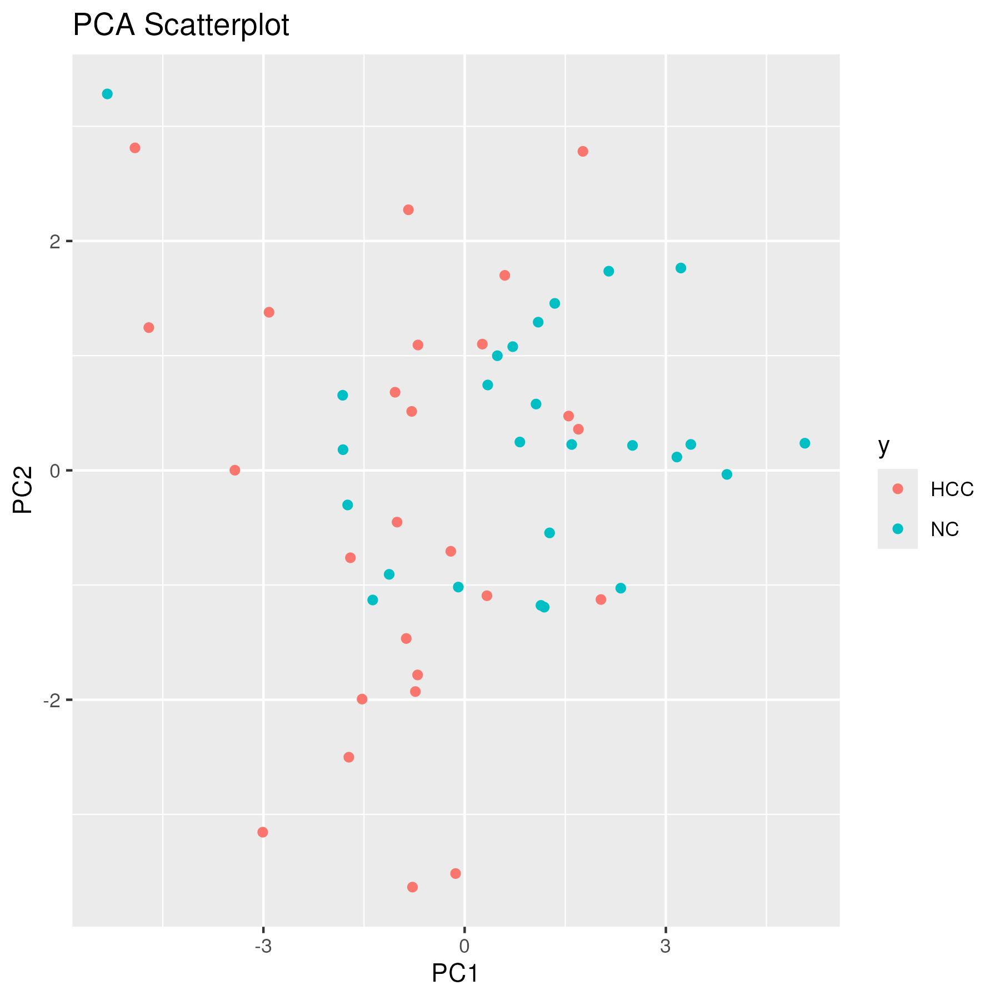
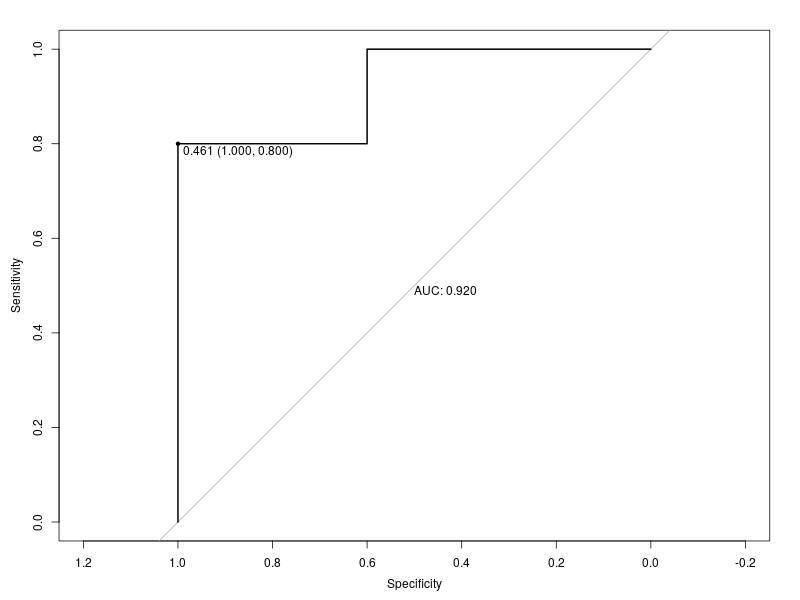

# Part IV. Machine Learning
## 2. Machine Learning with R
## 课后作业

## 8.1
1. 数据预处理

用均值或中位数补全空缺值

对数据进行scaling

2. 数据可视化

用PCA对数据进行可视化

3. 数据集划分：预留20%数据用于评估模型泛化能力，剩下的用于模型拟合

4. 模型选择和模型拟合

任选一种分类器即可

特征选择: 用RFE或其他方式均可，特征数量不限

调参: 根据所选的分类器对相应的超参数进行搜索

5. 模型评估

计算预留数据集上的AUROC

6. 绘制ROC曲线

请提交代码，必要的文字解释和ROC曲线

## 8.2
请大家查阅资料，回答以下两个关于随机森林的问题：

1. 随机森林中树的数量是不是一个需要通过交叉验证调整的超参数?为什么?

2. 请问什么是随机森林的out-of-bag (OOB) error?它和bootstrapping有什么关系?

---

## 8.1
```R
#!/usr/bin/env Rscript

library(glmnet)
library(caret)
library(pROC)
library(mlbench)
library(ggplot2)

# 固定random seed保证结果可重复
set.seed(666) 

# 读数据
data <- read.csv("qPCR_data.csv")
y <- data[，13]

# 数据预处理
# 用均值或中位数补全空缺值
for (i in 2:12) {
  data[， i][is.na(data[， i])] <- mean(data[， i]， na.rm = TRUE)
}
# 对数据进行scaling
data_scaled <- scale(data[， 2:12]， center=T， scale=T)

# 数据可视化
#用PCA对数据进行可视化
pca.res <- prcomp(data_scaled， center=F， scale=F)
pca.scatterplot <-ggplot(as.data.frame(pca.res$x)， aes(x = PC1， y = PC2， color = y)) +
  geom_point() +
  labs(title = "PCA Scatterplot"，
       x = "PC1"，
       y = "PC2")
ggsave("pca_scatterplot.png"， pca.scatterplot， width = 6， height = 6， dpi = 300)


# 数据集划分
# 预留20%数据用于评估模型泛化能力，剩下的用于模型拟合
trainIndex <- createDataPartition(y， p = 0.8， times = 1， list = T)$Resample1
train <- data_scaled[trainIndex， ]
test <- data_scaled[-trainIndex， ]
train_y <- y[trainIndex]
test_y <- y[-trainIndex]


# 模型选择和模型拟合
# 基于logistic regression的特征选择
lrFuncs$summary <- twoClassSummary 
rfectrl <- rfeControl(functions=lrFuncs，
                      verbose = F，
                      method="boot"，number=13)
rfe.results <- rfe(train，factor(train_y)， 
               sizes=2:12， 
               rfeControl=rfectrl，
               metric = "ROC")
# 输出保留的特征
predictors(rfe.results)

# 带正则化的logistic regression，通过交叉验证调参
params.grid <- expand.grid(alpha = c(0，0.1，0.2，0.3，0.4，0.5，0.6，0.7，0.8，0.9，1)，lambda = c(0，0.1，0.2，0.3，0.4，0.5，0.6，0.7，0.8，0.9，1))
tr.ctrl <- trainControl(method="boot"，
                        number = 6，
                        summaryFunction = twoClassSummary，
                        classProbs = TRUE)
cv.fitted <- train(train[，predictors(rfe.results)]，train_y，
                   method="glmnet"，
                   family="binomial"，
                   metric = "ROC"，
                   tuneGrid = params.grid，
                   preProcess = NULL，
                   trControl = tr.ctrl )
# 输出最好的一组超参数组合
cv.fitted$bestTune


# 模型评估
test_y.pred.prob <- predict(cv.fitted，newdata=test，type="prob")
roc.curve <- roc(test_y，test_y.pred.prob[，2])
# 计算预留数据集上的AUROC
auc(roc.curve)

# 绘制ROC曲线
png("roc_curve.png"， width = 800， height = 600)
plot(roc.curve， print.thres = "best"， print.auc = TRUE)
dev.off()

```

运行输出结果
```
[1] "SNORD3B"          "miR.122"          "miR.223"          "hsa_circ_0073052"
[5] "miR.21"
   alpha lambda
79   0.7    0.1
Setting levels: control = HCC， case = NC
Setting direction: controls < cases
Area under the curve: 0.92
```
可见选择了5个特征："SNORD3B"，"miR.122"，"miR.223"，"hsa_circ_0073052"，"miR.21"

最好的一组超参数组合：alpha-0.7， lambda-0.1

AUROC：0.92





## 8.2

1. 是一个需要通过交叉验证调整的超参数。随机森林算法的一个重要特点是使用大量决策树来进行集成学习。树的数量是一个重要的超参数，因为它决定了模型的复杂度和预测性能。因此，需要通过交叉验证的方式来选择一个合适的树的数量。交叉验证可以帮助我们评估不同树的数量下模型的泛化性能，从而选择一个最优的参数值。

2. OOB error 是随机森林算法中的一个内置评估方法。在训练每棵决策树时，随机森林算法会使用约 2/3 的样本进行训练，而将剩余的 1/3 样本作为 OOB 样本。对于每个样本，只有那些在训练时没有使用该样本的决策树，才会对该样本进行预测。然后将这些预测结果平均，就得到了该样本的 OOB 预测。OOB 误差就是所有 OOB 样本的平均预测误差。这个 OOB 误差可以作为一个无偏的模型评估指标，不需要额外的验证集。OOB 误差与 bootstrap有关，因为 bootstrap是随机森林算法用来生成训练集的方法。每棵决策树都是在一个 bootstrap训练集上训练的，剩下的就是 OOB 样本。