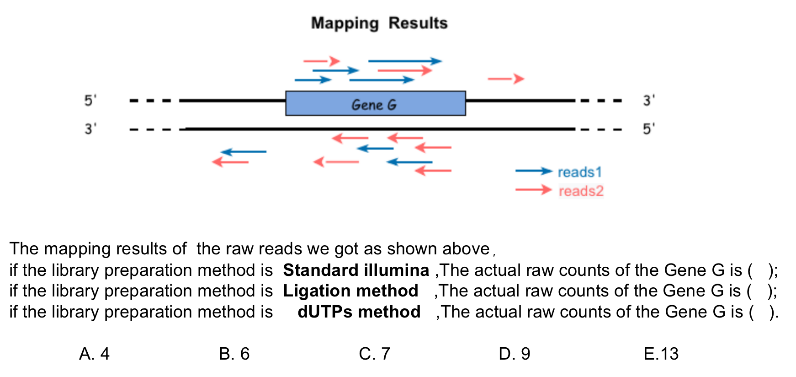

# Part III. NGS DATA ANALYSES
## 2.1 Expresssion Matrix
## 课后作业

1) 请阐述 RNA-seq 中归一化基因表达值的几种基本计算方法。

2) 根据下述图片描述，填出对应选项:


3) 通过软件计算，判断给出文件shape02数据是来自哪一种sequencing protocols （strand nonspecific, strand specific - forward, strand specific - reverse)，并选择合适的参数计算shape02的read count matrix，给出AT1G09530基因(PIF3基因)上的counts数目。

4) tumor-transcriptome-demo.tar.gz提供了结肠癌(COAD)，直肠癌(READ)和食道癌(ESCA)三种癌症各50个样本的bam文件用featureCount计算产生的结果。请大家编写脚本将这些文件中的counts合并到一个矩阵中(行为基因，列为样本), 计算logCPM的Z-score，并用 heatmap 展示，提供代码和heatmap。根据heatmap可视化的结果，你认为这三种癌症中哪两种癌症的转录组是最相似的?


---

1. 
用于比较简单的small RNA-seq
$$RPM(Reads\ per\ million) = \frac{Number\ of\ reads\ mapped\ to\ a\ gene \times 10^6}{Total\ number\ of\ mapped\ reads\ from\ given\ library}$$

用于single-end RNA-seq
$$RPKM(reads\ per\ kilobase\ million) = \frac{Number\ of\ reads\ mapped\ to\ transcript}{Total\ reads\times Transcript\ length\ in\ kbp}\times 10^6$$
用于paired-end RNA-seq
$$FPKM(fragments\ per\ kilobase\ million)= \frac{RPKM}{2}$$
$$TPM=\frac{RPKM}{\sum (RPKM)}\times 10^6$$

2. 
```
1. E
2. D
3. A
```

3. 
使用云盘里面的Shape02.bam
```bash
root@featurecount_docker:/home/test# cd /home/test
root@featurecount_docker:/home/test# /usr/local/bin/infer_experiment.py -r GTF/Arabidopsis_thaliana.TAIR10.34.bed -i bam/Shape02.bam
Reading reference gene model GTF/Arabidopsis_thaliana.TAIR10.34.bed ... Done
Loading SAM/BAM file ...  Total 200000 usable reads were sampled


This is PairEnd Data
Fraction of reads failed to determine: 0.0277
Fraction of reads explained by "1++,1--,2+-,2-+": 0.4783
Fraction of reads explained by "1+-,1-+,2++,2--": 0.4939

# 因为两种Fraction都是大概1：1，所以应该是strand nonspecific
```

```bash
root@featurecount_docker:/home/test# /home/software/subread-2.0.3-source/bin/featureCounts \
-s 0 -p -t exon -g gene_id \
-a GTF/Arabidopsis_thaliana.TAIR10.34.gtf \
-o result/Shape02.featurecounts.exon.txt bam/Shape02.bam

# Process BAM file Shape02.bam...                                               ||
# ||    Paired-end reads are included.                                          ||
# ||    The reads are assigned on the single-end mode.                          ||
# ||    Total alignments : 54529485                                             ||
# ||    Successfully assigned alignments : 51108139 (93.7%)                     ||
# ||    Running time : 0.49 minutes

root@featurecount_docker:/home/test# grep -Ev '^#' result/Shape02.featurecounts.exon.txt | grep 'AT1G09530' | cut -f 1,7 
AT1G09530       1782
```

4. 
分为主要3步（读数据，计算和输出图）
### 1. 读取数据，建立矩阵
to_matrix.R来读取COAD，ESCA和READ的数据，放进counts_df
```R
current_wd <- getwd()
# -----处理COAD-----
setwd(paste(current_wd, "COAD", sep = "/"))
files <- dir()
COAD_data <- data.frame()
index = 1

for (f in files){
  df <- read.table(f, header = T,sep = "")
  colnames(df)[7] <- paste("COAD",as.character(index),sep="")
  df <- df[,-(2:6)]
  if (index == 1){
    COAD_data <- df
  }
  else{
    COAD_data <- merge(COAD_data,df,by="Geneid")
  }
  index=index+1
}

# -----处理ESCA-----
setwd(paste(current_wd, "ESCA", sep = "/"))
files <- dir()
ESCA_data <- data.frame()
index = 1

for (f in files){
  df <- read.table(f, header = T,sep = "")
  colnames(df)[7] <- paste("ESCA",as.character(index),sep="")
  df <- df[,-(2:6)]
  if (index == 1){
    ESCA_data <- df
  }
  else{
    ESCA_data <- merge(ESCA_data,df,by="Geneid")
  }
  index=index+1
}

# -----处理READ-----
setwd(paste(current_wd, "READ", sep = "/"))
files <- dir()
READ_data <- data.frame()
index = 1

for (f in files){
  df <- read.table(f, header = T,sep = "")
  colnames(df)[7] <- paste("READ",as.character(index),sep="")
  df <- df[,-(2:6)]
  if (index == 1){
    READ_data <- df
  }
  else{
    READ_data <- merge(READ_data,df,by="Geneid")
  }
  index=index+1
}
counts_df <- merge(COAD_data,ESCA_data,by="Geneid")
counts_df <- merge(counts_df,READ_data,by="Geneid")
rm(df,index)
rm(COAD_data,ESCA_data,READ_data)
setwd(current_wd)
counts_df
```
### 2. 计算CPM和z-score
calculation.R做计算，生成z_scores.txt
```R
counts.matrix <- read.table("stdin", sep = "\t", header = TRUE)
counts.matrix <- counts.matrix[,-c(1)]

CPM.matrix <- t(1000000*t(counts.matrix)/colSums(counts.matrix))
log10.CPM.matrix <- log10(CPM.matrix+1)

z.scores <- (log10.CPM.matrix - rowMeans(log10.CPM.matrix))/apply(log10.CPM.matrix,1,sd)
write.table(z.scores,"z_scores.txt",quote = F)
```

main.R用来调用上面的to_matrix.R和calculation.R
```R
counts.matrix <- source("to_matrix.R")$value
pipe_script <- pipe("Rscript calculation.R", "w")
write.table(counts.matrix, pipe_script, sep = "\t", row.names = FALSE)
close(pipe_script)
```
### 3. 画 heatmap
```R
library(pheatmap)
library(ggplot2)
df = read.table("z_scores.txt")
df[is.na(df[,1:ncol(df)])]=0
df[df > 2]=2
df[df < -2]=-2
annotation_col = data.frame(CellType = factor(rep(c("COAD", "ESCA" ,"READ"), c(50,50,50))))
rownames(annotation_col) = colnames(df)
ann_colors = list(CellType = c(COAD = "#7FBC41", ESCA = "#DE77AE", READ = "#807DBA"))
heatmap <- pheatmap(df,cutree_cols = 3,annotation_col = annotation_col,annotation_colors = ann_colors,
       cluster_rows=F, cluster_cols=F, show_rownames=F,show_colnames = F)
ggsave("pheatmap.png", plot = heatmap$gtable)
```
### 结论
COAD和READ的转录组应该是最相似的。


