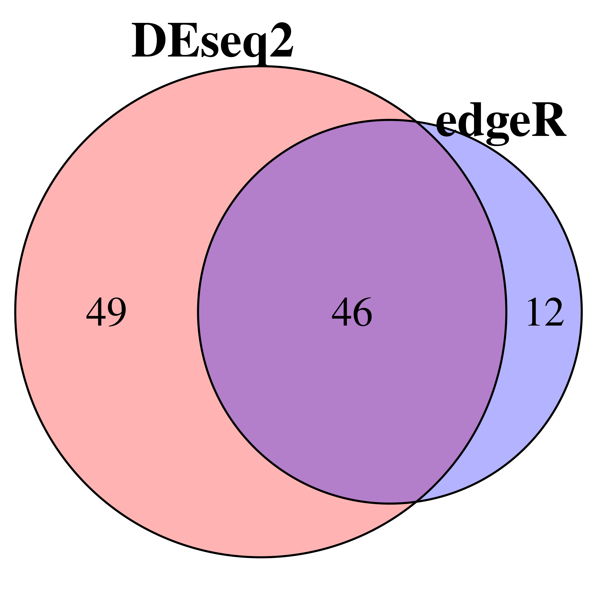
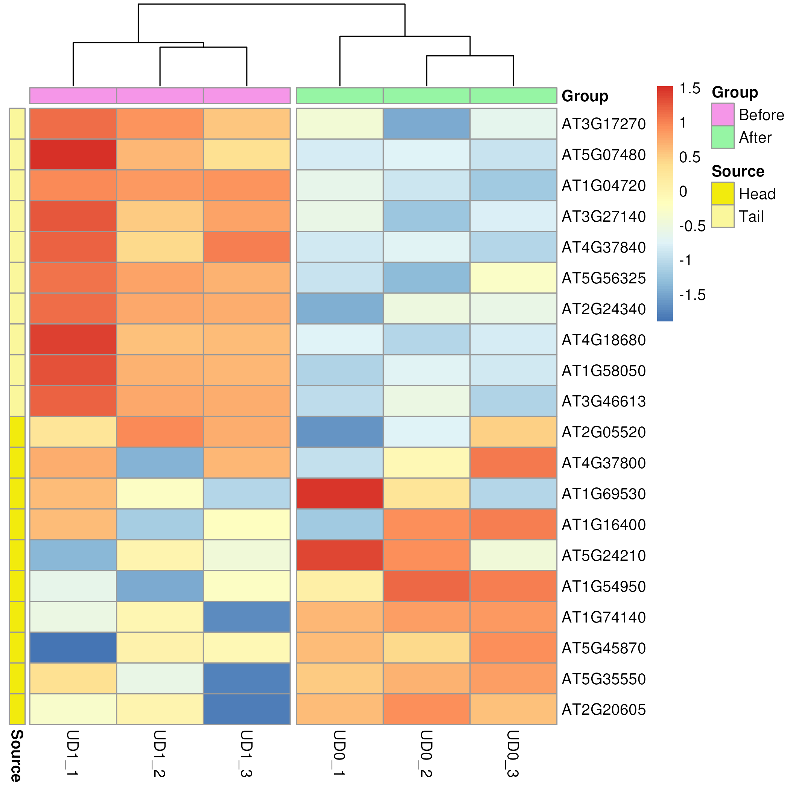

# Part III. NGS DATA ANALYSES
## 2.3 Differential Expression with DEseq2 and edgeR
## 课后作业

1. 什么是Multiple test correction? 并解释 q value(很多时候也叫FDR) 和 p value 的差别。

2. 请结合上课时所讲的知识阐述DESeq2和edgeR中如何对数据进行 normalization，列出并解释具体的公式 。

3. 利用我们以上介绍的方法和数据，分别使用DESeq2和edgeR找出uvr8突变型（uvr8）在光照前后的差异基因，保存为文本文件

4. 对于uvr8突变型的差异基因，定义|log2FC|>1，FDR<0.05的基因为差异表达基因。比较两个软件得到的差异基因有多少是重合的，有多少是不同的，用venn图的形式展示

5. 对于edgeR找出的FDR<0.05的基因，选出log2FoldChange最大的10个基因和最小的10个基因。计算原始表达量矩阵的log10CPM值并对每个基因进行Z-score处理，使用刚才筛选出来的20个基因绘制热图（heatmap）作为最后结果输出。

---

#### 1. 
*Multiple Test Correction*: 是一种统计方法，用于调整在同一数据集上进行多个统计检验所得到的p值。当进行多个统计检验时，至少出现一个假阳性(I型错误)的概率会随着检验数量的增加而增加。多重检验校正的目的是控制总体错误率，减少假阳性结果的可能性。

*p value*: 代表了反对原假设的证据的强度。P值越低,反对原假设的证据越强。传统的显著性水平通常设为0.05，意味着如果p值小于0.05，结果被认为是统计学显著。

*q value*: Q值调整了p值，以考虑多重检验，提供了更保守的统计显著性估计。Q值阈值为0.05意味着,平均而言,5%的显著发现将是假阳性。

所以p value和q value最大的差别是p value是单个检验的统计显著性度量，而q value考虑了多重检验。


#### 2. 
### EdgeR使用TMM
使用Trimmed Mean of M values (TMM)进行标准化的步骤如下：

1. 首先，选择一个参考样本作为校正的基准。

2. 通过比较每个样本的每百万计数（CPM）的上四分位数与所有样本的平均上四分位数之间的差异来选择参考样本。选择差异最小的样本作为参考样本。

3. 计算参考样本与每个非参考样本之间的校正因子。这涉及计算每个基因在参考样本和非参考样本之间的折叠变化（M）和平均表达量（A）。

    - M的计算公式为：M = log2（处理样本计数/对照样本计数）。

    - A的计算公式为：A = （log2（处理样本计数）+ log2（对照样本计数））/ 2。

    - 只保留M和A值均为有限值的基因，同时过滤掉表达量极低的基因。

4. 对M和A值进行双重截取。截取M值的前30%和后30%，以及A值的前5%和后5%。这一步骤用于计算在这一范围内的中间基因的权重。每个基因的权重（w）的计算公式如下：
$$w(g)=\frac{D_{treatment}-K_{treatment}(g)}{D_{treatment}\times K_{treatment}(g)}+\frac{D_{control}-K_{control}(g)}{D_{control}\times K_{control}(g)}$$
$$TMM=\frac{\sum_{g\in G}w(g)\times M(g)}{\sum_{g\in G}w(g)}$$

其中g代表每个基因，D代表每个样本中总的reads数，K代表基因g的reads数。

5. 使用M值的加权平均（TMM）计算每个样本的标准化因子(C)：

$$\frac{C_{raw}(g)}{C}=\frac{K(g)}{C}$$

6. 通过将原始计数除以标准化因子（C）并乘以一个常数因子，来校正每个基因的表达水平


### DSeq2使用RLE
使用RLE（相对对数表达式）进行标准化的步骤如下：
1. 为每个基因创建一个假参考样本的表达量，该值代表理想的基因表达量。通过计算每个基因的几何平均值来获得该值。
$$({\prod_{i=1}^nK_{gl}})^\frac{1}{n}=\sqrt[n]{x_1x_2...x_n}$$
2. 对于每个基因的样本，计算样本内基因表达量与参考样本表达量之间的比值。

样本内所有比率的中值即为校正因子（标准化因子）。
$$C_j=median\{\frac{K_{gj}}{(\prod_{i=1}^nK_{gl})^\frac{1}{n}}\}$$
3. 通过将原始计数除以标准化因子并乘以一个常数因子，来校正每个基因的表达水平
$$\frac{C_{raw}(g)}{C_{j}}=\frac{K_{gj}}{C_{j}}$$
#### 3. 
```R
# install
install.packages("BiocManager")
BiocManager::install("DESeq2")
BiocManager::install("edgeR")
```

```R
# preparation.R
#读取数据
raw.counts <- read.table("count_exon.txt", sep='\t', header = T,row.names = 1)

mutant.raw.counts <- raw.counts[,c("UD1_1", "UD1_2", "UD1_3", "UD0_1", "UD0_2", "UD0_3")]
#过滤掉表达量过低的基因
mutant.filtered.counts <- mutant.raw.counts[rowMeans(mutant.raw.counts) > 5, ]
conditions <- factor(c(rep("Control", 3), rep("Treatment", 3)),levels = c("Control","Treatment"))
colData <- data.frame(row.names = colnames(mutant.filtered.counts),conditions=conditions)
design <- model.matrix(~conditions)
```

```R
# deseq2.R
#使用DESeq2 package
suppressPackageStartupMessages(library(DESeq2))

source("preparation.R")
dds <- DESeqDataSetFromMatrix(mutant.filtered.counts, colData, design = ~conditions)
#进行差异分析
dds <- DESeq(dds)
#获取结果
res <- results(dds)

# 保存
write.table(res,"deseq.mutant.light.vs.dark.txt", sep='\t', row.names = T, quote = F)
```

```R
# edger.R
library(edgeR)
source("preparation.R")

 # 定义edgeR用于存储基因表达信息的DGEList对象
y <- DGEList(counts = mutant.filtered.counts)

# TMM标准化 (TMM 实际上是edgeR的默认参数)
y <- calcNormFactors(y, method="TMM")

# 估计dispersion
y <- estimateDisp(y,design = design)
# 拟合广义线性模型
fit <- glmFit(y, design = design)

# 似然比检验
# coef = 2指的是对design矩阵的第二列（即是否照光）对应的系数进行检验
lrt <- glmLRT(fit,coef=2) 
# topTags意思是返回变化最top的基因
# 默认返回10个基因，按p值排序
# 这里我们用n = nrow(y)要求它返回所有基因的结果
diff.table <- topTags(lrt, n = nrow(y))$table

# 保存
write.table(diff.table, file = 'edger.mutant.light.vs.dark.txt', sep = "\t", quote = F, row.names = T, col.names = T)

```

#### 4. 
```R
# venn_diagram.R
library(VennDiagram)

deseq2.mutant.data <- read.table("deseq.mutant.light.vs.dark.txt",header = T,sep = '\t')
deseq2.mutant.data <- subset(deseq2.mutant.data,padj < 0.05 & abs(log2FoldChange) > 1)
edger.mutant.data <- read.table("edger.mutant.light.vs.dark.txt",header = T,sep = '\t')
edger.mutant.data <- edger.mutant.data[abs(edger.mutant.data$logFC) > 1 & edger.mutant.data$FDR < 0.05,]

venn.plot <- venn.diagram(
  x = list(
    DEseq2=rownames(deseq2.mutant.data),
    edgeR=rownames(edger.mutant.data)
  ),
  filename = "venn_diagram.png", imagetype = "png",
  fill = c("red","blue"),
  alpha = 0.3, 
  cex = 2.5, 
  cat.cex = 3,
  cat.fontface = "bold",
  cat.pos = c(-10, 30)
)
```


#### 5. 
```R
# heatmap.R
library(pheatmap)
library(edgeR)
library(ggplot2)

# 准备数据
raw.counts <- read.table("count_exon.txt", sep = '\t', header = TRUE, row.names = 1)
mutant.raw.counts <- raw.counts[, c("UD1_1", "UD1_2", "UD1_3", "UD0_1", "UD0_2", "UD0_3")]
edger.mutant.data <- read.table("edger.mutant.light.vs.dark.txt", sep = '\t', header = TRUE, row.names = 1)
edger.mutant.data <- subset(edger.mutant.data, FDR < 0.05)
edger.mutant.data <- edger.mutant.data[order(edger.mutant.data$logFC), ]
target <- rbind(head(edger.mutant.data, n = 10), tail(edger.mutant.data, n = 10))
counts.matrix <- mutant.raw.counts[rownames(target), ] 

# 计算log10CPM
y <- DGEList(counts = counts.matrix)
CPM.matrix <- cpm(y, log = FALSE)
log10.CPM.matrix <- log10(CPM.matrix + 1)

# 计算z-scores
z.scores <- (log10.CPM.matrix - rowMeans(log10.CPM.matrix))/apply(log10.CPM.matrix,1,sd)

# 标注和颜色
annotation_col <- data.frame(Group = factor(c(rep("Before", 3), rep("After", 3))))
annotation_row <- data.frame(Source = factor(c(rep("Tail", 10), rep("Head", 10))))
rownames(annotation_col) <- colnames(z.scores)
rownames(annotation_row) <- rownames(z.scores)
ann_colors <- list(Group = c(Before = "#F596E8", After = "#96F5A4"),
                   Source = c( Head = "#F2EB0D",Tail = "#FAF79C"))

# 画heatmap
heatmap <- pheatmap(
    z.scores, 
    annotation_col = annotation_col,
    annotation_row = annotation_row,
    annotation_colors = ann_colors, 
    cutree_cols = 2,
    cluster_cols = TRUE,
    cluster_rows = FALSE, 
    show_rownames = TRUE)
ggsave("pheatmap.png", plot = heatmap$gtable)
```
