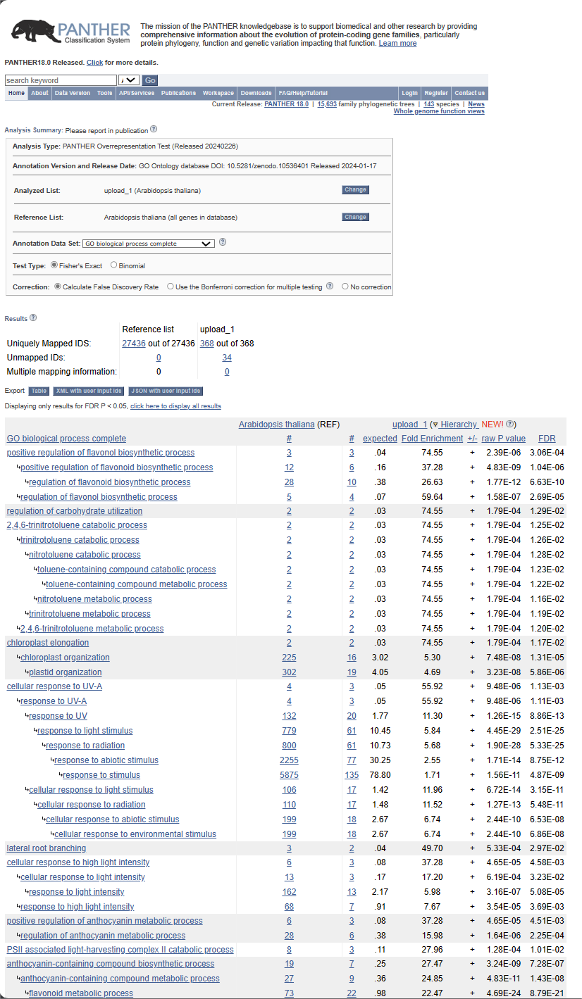
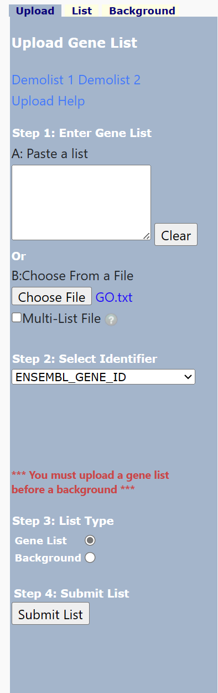
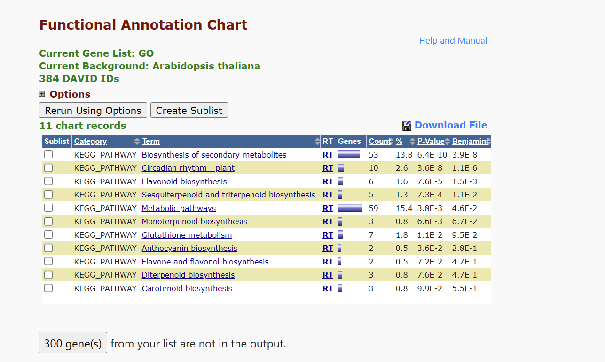

# Part II. Basic Analyses
## 3.1. GO
## 课后作业

1. 从wt.light.vs.dark.all.txt(这是我们在差异表达一节获得的野生型的结果)中选取显著上调的(FDR<0.05, logFC>1)的基因进行GO分析。

2. 请问上面的例子中， Fold Enrichment和P value是如何计算的? 请写出公式，并解释原理。此外，在定义显著富集的 GO terms 时为什么一般不是参考P value的大小，而是要计算一个 FDR来做为参考？
---
1. 
```R
# go_prep.R
data <- read.table("wt.light.vs.dark.all.txt", header = TRUE, sep = '\t')
data.filtered <- subset(data, log2FoldChange > 1 & data$padj < 0.05)
genes <- rownames(data.filtered)
write.table(genes, "GO.txt", sep = "\n", quote = FALSE, row.names = FALSE, col.names = FALSE)
```
把结果输入http://geneontology.org/

2. 
p-value的计算
$$p\ value=\frac{\binom{n}{k}\binom{N-n}{K-k}}{\binom{N}{K}}$$

```
N是参考基因组中所有编码蛋白的基因中有GO注释的基因的数目
K是参考基因组中在这个GO条目上面有注释的基因的数目
n是输入的做富集分析的基因的数目
k是输入的做富集分析的基因中注释到这个GO条目上面的基因的数目
```

fold enrichment的计算
$$fold\ enrichment=\frac{gene\ ratio}{background\ ratio}$$

```
gene ratio表示富集在GO条目上的基因数量与进行富集分析的所有输入基因数量之间的比值。这些输入基因可以是通过差异表达分析获得。

background ratio表示在参考基因组中所有编码蛋白质的基因中，具有GO注释的基因数量与在GO条目上进行注释的基因数量之间的比值。
```
**为什么一般不是参考P value的大小，而是要计算一个 FDR来做为参考？**<br>
对p值进行多重假设检验后，经过校正的p值能够更有效地控制假阳性率。


# Part II. Basic Analyses
## 3.2. KEGG
## 课后作业

#### 设定

#### 结果


GO和KEGG分析在某些方面存在相似性和差异。这两种方法都为我们提供了有关基因功能及其在生物途径中的作用的重要见解。然而，它们之间存在明显的特点区别。

GO分析主要基于基因序列信息。它利用一个由单个GO术语构成的层次结构。它的根节点有BP（生物过程）、CC（细胞组分）和MF（分子功能）。GO术语代表基因集，但不明确定义基因之间的关系。这种分析方法使我们能够在基因表达之前确定基因功能。

另一方面，KEGG分析基于基因表达信息。KEGG由人工注释的代谢通路组成，呈现为相互连接的网络。它不仅包括基因集，还定义了基因与代谢物之间的复杂关系，使其成为一个全面的通路数据库。KEGG分析需要基因表达数据，以评估基因在生物系统中的相互作用和动态变化。

在相似性方面，GO的BP和KEGG之间存在显著重叠。这意味着GO中表示的生物过程与KEGG中的代谢通路之间存在较高的相似性。

虽然GO分析主要关注基因的个体功能，但KEGG分析强调基因在生物系统中的相互作用和关系。KEGG的系统性视角提供了对基因在复杂生物过程中相互作用和作用的更广泛理解。
